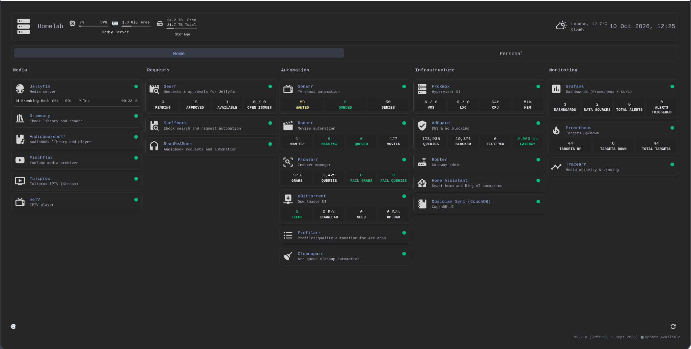
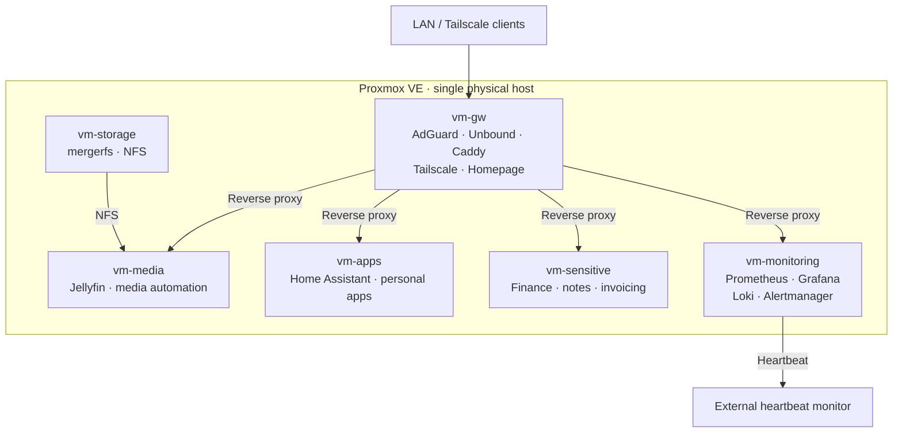
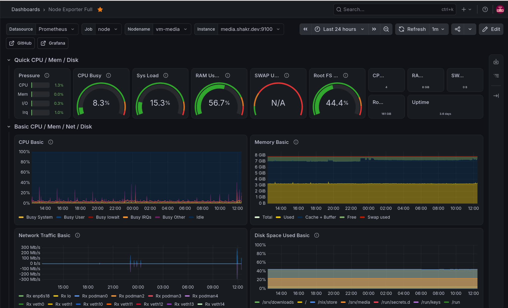

# homelab-nix

**A declarative NixOS homelab on Proxmox, provisioned with OpenTofu and deployed with Colmena.**

Six role-based NixOS VMs run networking, media, storage, home automation, personal applications and observability. Host configuration lives in a single Nix flake, with Podman and native NixOS services, sops-nix for secrets and Renovate for dependency updates.



## Architecture

OpenTofu provisions the guests on one Proxmox server; NixOS modules define their configuration, and Colmena deploys changes over SSH. Each host combines shared defaults with a role-specific profile.



*Simplified service architecture, not a full network topology.* The MikroTik router handles routing and VLAN policies; `vm-gw` handles internal DNS, reverse proxying and Tailscale access.

| VM | Role | Representative services |
| --- | --- | --- |
| [`vm-gw`](nix/hosts/vm-gw/default.nix) | DNS, ingress, remote access | AdGuard, Unbound, Caddy, Tailscale, Homepage |
| [`vm-media`](nix/hosts/vm-media/default.nix) | Media and automation | Jellyfin, Sonarr, Radarr, qBittorrent, Audiobookshelf |
| [`vm-storage`](nix/hosts/vm-storage/default.nix) | Shared bulk storage | mergerfs, NFS |
| [`vm-apps`](nix/hosts/vm-apps/default.nix) | Home automation and personal apps | Home Assistant, Obsidian Livesync, Yamtrack |
| [`vm-sensitive`](nix/hosts/vm-sensitive/default.nix) | Personal and financial apps | Actual Budget, Standard Notes, InvoicePlane |
| [`vm-monitoring`](nix/hosts/vm-monitoring/default.nix) | Metrics, logs, probes, alerting | Prometheus, Grafana, Loki, Alertmanager |

<details>
<summary>Full service inventory</summary>

This lists the service modules configured for each role.

| VM | Configured services and components |
| --- | --- |
| `vm-gw` | AdGuard, Unbound, Caddy, Tailscale, Homepage; NFS client |
| `vm-media` | Jellyfin, Seerr, Tracearr, Sonarr, Radarr, Prowlarr, FlareSolverr, Shelfmark, ReadMeABook, Grimmory, Audiobookshelf, Gluetun, qBittorrent, Profilarr, Cleanuparr, TuliProx, Pinchflat, NetV; NFS client and mount probe |
| `vm-storage` | mergerfs, NFS server |
| `vm-apps` | Home Assistant, Obsidian Livesync, Yamtrack |
| `vm-sensitive` | Actual Budget, Standard Notes, InvoicePlane |
| `vm-monitoring` | Prometheus, Grafana, Alertmanager, Loki, Proxmox Exporter, Blackbox Exporter, external health-gated heartbeat |

All six VMs also import the shared Node Exporter and Promtail modules via the [base profile](nix/profiles/base/default.nix).

</details>

## Interesting implementations

This is my own infrastructure rather than a reusable installer but several components may be useful independently:

| Area | Implementation | Why it's worth a look |
| --- | --- | --- |
| Provisioning and deployment | [`infra/vms.tf`](infra/vms.tf) · [`flake.nix`](flake.nix) | Proxmox VM definitions alongside six NixOS configurations and a Colmena hive |
| Role-based modules | [`nix/profiles/`](nix/profiles) | Shared defaults separated from application-specific roles |
| Service discovery | [`records.nix`](nix/modules/dns/records.nix) | Common DNS and reverse-proxy host definitions |
| Runtime secrets | [`templates.nix`](nix/modules/secrets/templates.nix) | sops-nix secrets rendered into environment files with dependent service restarts |
| Monitoring the monitor | [`heartbeat/default.nix`](nix/services/monitoring/heartbeat/default.nix) | A systemd timer only sends an external heartbeat when local alerting checks pass |
| Storage and passthrough | [`mergerfs/default.nix`](nix/services/mergerfs/default.nix) · [`pci.tf`](infra/pci.tf) | Pooled media storage and Intel iGPU passthrough to the media VM |
| Home Assistant configuration | [`home-assistant/default.nix`](nix/services/home-assistant/default.nix) | Declarative configuration validated before activation |

## Observability

Prometheus scrapes NixOS and Proxmox metrics; Blackbox Exporter checks HTTP service availability; and Promtail forwards host logs to Loki. Alertmanager sends Telegram notifications. A separate, health-gated external heartbeat helps detect failures in the local monitoring and alerting pipeline.



See the [monitoring modules](nix/services/monitoring) for exporters, probes, alert rules, logs, and dashboards.

## Repository layout

```text
.
├── flake.nix       # NixOS hosts, Colmena hive, Proxmox template
├── infra/          # OpenTofu / Proxmox provisioning
├── nix/
│   ├── hosts/      # Per-VM settings
│   ├── profiles/   # Shared defaults and role-specific composition
│   ├── modules/    # Reusable NixOS options
│   └── services/   # Applications and observability
├── secrets/        # Encrypted SOPS files
├── templates/      # Proxmox NixOS template definition
├── Makefile        # Provisioning and deployment shortcuts
└── renovate.json   # Automated dependency updates
```

## Exploring and adapting

This is a personal, hardware-specific configuration, not a plug-and-play installer. To explore the flake outputs without deploying anything:

```bash
git clone https://github.com/shakirware/homelab-nix.git
cd homelab-nix
nix flake show
nix eval --raw .#nixosConfigurations.vm-gw.config.networking.hostName
```

Before reusing it, review the [OpenTofu configuration](infra), host interfaces and disk identifiers, internal addresses and domains, SSH settings, and SOPS recipients. The encrypted secrets belong to this installation and cannot be decrypted with unrelated keys.

<details>
<summary>Deployment commands used in this homelab</summary>

```bash
# Build the guest template on a suitable Linux builder
nix build .#proxmox-template

# Review and apply Proxmox infrastructure changes
make plan
make apply            # Modifies Proxmox resources

# Reconfigure an individual guest or all guests
make deploy-gw
make deploy-monitoring
make deploy-all       # Changes running NixOS systems
```

Provisioning requires OpenTofu and Proxmox credentials; deployments require working Colmena SSH access and appropriate SOPS decryption keys. Do not run these commands unchanged against your own environment. See the [`Makefile`](Makefile) for other targets.

</details>

## Hardware

The lab runs on a single server built mostly from second-hand components, balancing cost, noise and power use.

| Component | Hardware |
| --- | --- |
| CPU | Intel Core i3-8100; iGPU passed through to `vm-media` |
| Memory | 32 GB DDR4 |
| Motherboard | ASUS PRIME H370-A |
| Boot / VM storage | 512 GB NVMe SSD |
| Bulk storage | 2 × 16 TB Seagate IronWolf Pro HDDs |
| Case / PSU | Fractal Design Define R5 / Seasonic Focus GX-750 |
| Router | MikroTik hAP ax2 |
| Observed idle | Approximately 32 W |

The current NIC limits deeper CPU C-states; a different NIC might reduce idle consumption.

## Trade-offs

- **Storage redundancy.** mergerfs combines multiple drives into a single storage pool without providing data redundancy. Independent backups and tested recovery procedures remain essential, even with redundant storage.
- **Infrastructure outside Git.** The MikroTik router's VLAN and firewall configuration, along with the underlying Proxmox host setup are managed manually.
- **This is site-specific.** Disk mappings, IP addresses, hardware passthrough, and secrets require adaptation.

## Roadmap

- [ ] Wait for HDD prices to come back down to Earth, add storage redundancy and set up automated off-site backups with tested restores.
- [ ] Deploy Immich for photo management once the storage and backup setup is ready.
- [ ] Pick up a reasonably priced second-hand duplex ADF scanner and deploy Paperless-ngx.
- [ ] Deploy Vaultwarden for password management and evaluate Copyparty for file sharing.
- [ ] Add automated Nix/OpenTofu checks.

## Feedback

This is a personal homelab shared as a technical reference. If you have suggestions for NixOS modules, Proxmox provisioning, storage or monitoring, feel free to [open an issue](https://github.com/shakirware/homelab-nix/issues).
